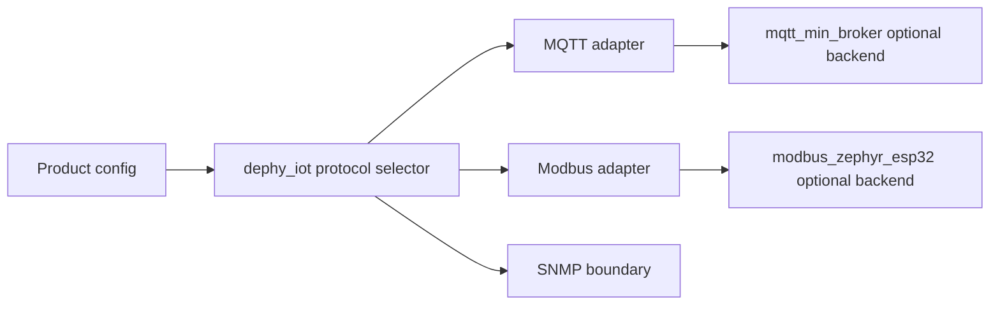
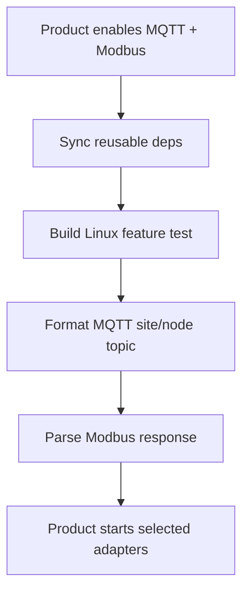

# dephy_iot

Reusable IoT protocol adapter module for Dephy and Zephyr projects.

## Overview

`dephy_iot` coordinates protocol adapter boundaries for MQTT, Modbus, and SNMP.
It is the place for reusable protocol glue, not product provisioning workflow.

## Key Value

- Feature-gated MQTT, Modbus, and SNMP adapter startup.
- MQTT topic formatting and broker integration hook.
- Modbus adapter config, CRC helper, RTU response parser, and backend hook.
- Dependency policy check that rejects product-to-product dependencies.
- Linux unit tests plus Zephyr module smoke coverage.

## How To Use

```sh
make -f Makefile.linux test
make -f Makefile.linux MQTT=1
make -f Makefile.linux MODBUS=1
make -f Makefile.linux SNMP=1
./scripts/sync_deps.sh
./scripts/build_zephyr.sh
```

```conf
CONFIG_DEPHY_IOT=y
CONFIG_DEPHY_IOT_MQTT=y
CONFIG_DEPHY_IOT_MODBUS=y
```

## Architecture Flow



## Example User Scenario



## Simple Principle

Products choose protocols and provide settings. `dephy_iot` keeps adapter
startup and protocol glue reusable.

## Docs

- `docs/module_structure.md`: adapter layout and dependency boundary.
- `docs/todo.md`: current TODO summary.
